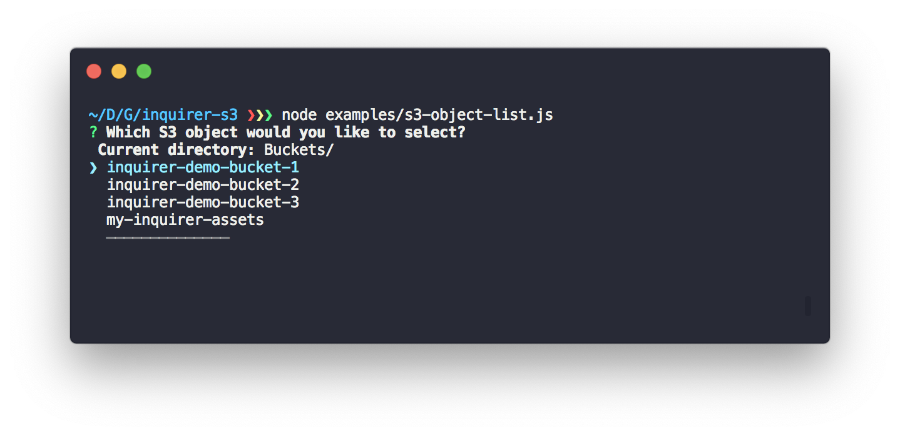

# inquirer-s3
> An S3 object selector for inquirer.

[](contributing.md)
[](https://www.codefactor.io/repository/github/hqarroum/inquirer-s3)

<br /><br />
<p align="center">
  
</p>

Current version: **1.0.1**

Lead Maintainer: [Halim Qarroum](mailto:hqm.post@gmail.com)

## Table of content

 - [Installation](#install)
 - [Description](#description)
 - [Handling errors](#handling-errors)
 - [Provisionning AWS credentials](#provisionning-aws-credentials)
 - [Examples](#examples)
 - [See also](#see-also)

## Install

To add the `inquirer-s3` prompt to your application dependencies, run the following command :

```bash
npm install --save inquirer-s3
```

## Description

The `inquirer-s3` prompt allows you to use [inquirer](https://github.com/SBoudrias/Inquirer.js) to select an S3 object located on an AWS account. This prompt allows you to list buckets, objects within selected buckets and navigate across your buckets.

## Usage

### Register the prompt

In order to use `inquirer-s3`, you first need to register it with inquirer under a key name as follow.

```js
const inquirer = require('inquirer');
// Registers `inquirer-s3` under the key 's3-object'.
inquirer.registerPrompt('s3-object', require('inquirer-s3'));
```

### Listing buckets and objects

By default, the `inquirer-s3` prompt will list the S3 content of a given AWS account in a file-system like fashion, starting by listing available buckets in a given region, and allowing the promnpted user to navigate its buckets and objects. To start a prompt, you can use with `inquirer` the key that you used to register the `inquirer-s3` module.

```js
inquirer.prompt([{
  type: 's3-object',
  name: 'result',
  message: 'Which S3 object would you like to select?'
}]).then(console.log);
```

### Parameters

A set of optional parameters can be passed to `inquirer-s3`. Below is a description of all the optional parameters along with their role.

 - **bucket** - A bucket to pre-select. When specifying the `bucket` parameter with the name of a valid S3 account owned by your AWS account, the `inquirer-s3` module will start to browse at the root of this bucket.
 - **objectPrefix** - An S3 object prefix indicating where you'd like to start the browsing inside a bucket.
 
 > Note that it is invalid to pass an `objectPrefix` without specifying a valid `bucket`, and an error will be thrown in this case.

## Handling errors

When an error occurs, the promise returned by `inquirer` is still resolved, but will contain an `err` property as in the following sample output. This is due to the fact that there are no easy way to reject the promise in Inquirer from inside a plugin prompt.

```js
{ result: {
  err: {
    message: 'Missing credentials in config',
    errno: 'ETIMEDOUT'
  }
}
```

## Provisionning AWS credentials

The `inquirer-s3` plugin needs to retrieve STS tokens from AWS in order to interact with the S3 service on your account. The easiest way to achieve this is to have the [AWS CLI](https://aws.amazon.com/fr/cli/) installed **and** configured on your development or deployment machine.

> Read more on [Installing the AWS CLI](https://docs.aws.amazon.com/cli/latest/userguide/installing.html) and [Configuring the AWS CLI](https://docs.aws.amazon.com/cli/latest/userguide/cli-chap-getting-started.html).

If you happen to have the AWS CLI installed and configured with valid credentials on your local machine, `inquirer-s3` will automatically use these credentials to authenticate against the AWS services it is making requests against.

### Using AWS Profiles

If you have configured the AWS CLI with different [profiles](https://docs.aws.amazon.com/cli/latest/userguide/cli-configure-profiles.html), it is possible to explicitly specify an AWS profile to use by specifying the `AWS_PROFILE` variable in your environment such as in the following example.

```bash
AWS_PROFILE=my-custom-profile node examples/s3-object-list.js
```

### Specifying custom AWS credentials

If you do not have the AWS CLI installed or configured, or you would like to use `inquirer-s3` with custom credentials, you can pass your `AWS_ACCESS_KEY_ID` and your `AWS_SECRET_ACCESS_KEY` as environment variables of ur application such as in the following example :

```bash
$ AWS_ACCESS_KEY_ID=<access-key-id> AWS_SECRET_ACCESS_KEY=<secret-access-key> node examples/s3-object-list.js
```

> If you are using temporary credentials you can also specify an `AWS_SESSION_TOKEN` additionally to the aforementioned variables.

## Examples

Runnable examples are available in the [examples](examples/) directory.

## See also

 - The [inquirer](https://github.com/SBoudrias/Inquirer.js) interactive prompt framework.
 - The [s3-ls](https://github.com/koresar/s3-ls) object browser library.
